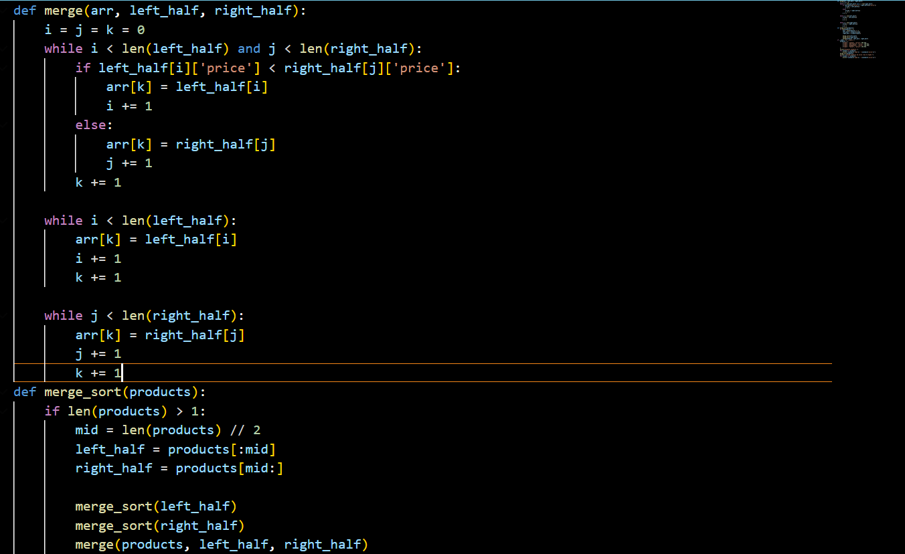
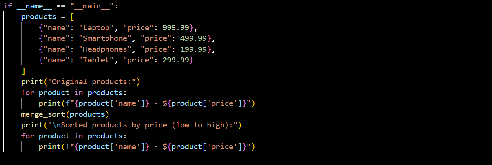
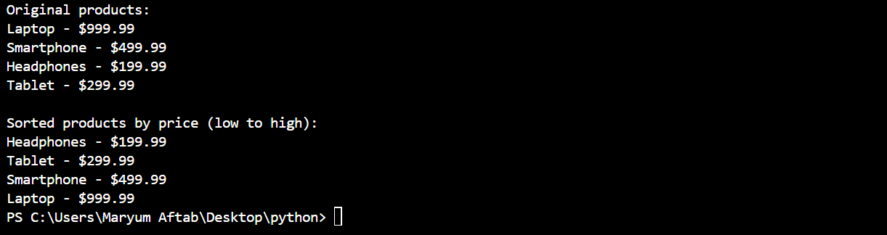
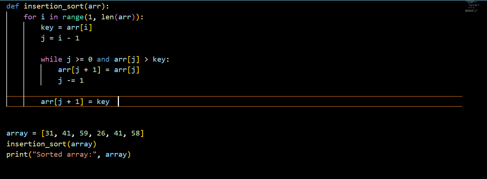
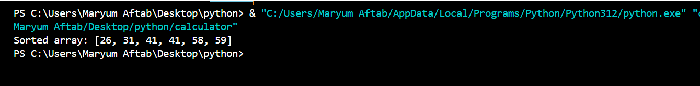
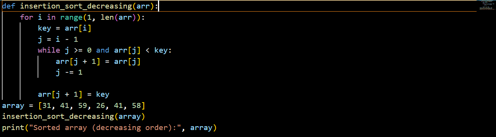
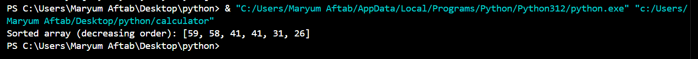

> **<u>Submitted by:</u>**
>
> Maryum Aftab
>
> **<u>Roll no:</u>**
>
> 14658
>
> **<u>Class:</u>**
>
> BSCS 3A
>
> **<u>Submitted to:</u>**
>
> Sir Jamal Abdul Ahad
>
> **<u>Subject:</u>**
>
> DSA
>
> **<u>Assignment</u>**
>
> 1
>
> **<u>Date:</u>**
>
> 8 October 2024
>
> **<u>Department:</u>**
>
> Computer science
>
> **<u>University:</u>**
>
> Abbottabad university of science and technology

**<u>Github link:https://github.com/Ma36632/maryum</u>**

> **<u>Chapter 1</u>**
>
> **<u>The role of Algorithms in computing</u>**

**<u>Exercises</u>**

**<u>Question 1</u>**

**Describe** **your** **own** **real-world** **example** **that**
**requires** **sorting.** **Describe** **one** **that** **requires**
**finding** **the** **shortest** **distance** **between** **two**
**points.**

**<u>Scenario:</u>**

Online Store Sorting Products by Price Imagine you are browsing an
online store that sells electronics. The store allows you to sort
products by price, either from lowest to highest or from highest to
lowest. This is a classic use case for sorting, where you want to
present the products in an organized way to help customers make better
purchasing decisions.

**<u>In this example:</u>**

**<u>Sorting criteria:</u>**

Price (either ascending or descending)

**<u>Why sorting is important:</u>**

It helps users quickly find products within their budget or compare
expensive and cheap products.This can be implemented using sorting
algorithms like Merge Sort or Quick Sort for efficient sorting,
especially when the number of products is large.

**<u>Code:</u>**

def merge(arr, left_half, right_half):

> i = j = k = 0
>
> while i \< len(left_half) and j \< len(right_half):
>
> if left_half\[i\]\['price'\] \< right_half\[j\]\['price'\]:
>
> arr\[k\] = left_half\[i\]
>
> i += 1
>
> else:
>
> arr\[k\] = right_half\[j\]
>
> j += 1
>
> k += 1
>
> while i \< len(left_half):
>
> arr\[k\] = left_half\[i\]
>
> i += 1
>
> k += 1
>
> while j \< len(right_half):
>
> arr\[k\] = right_half\[j\]
>
> j += 1
>
> k += 1

def merge_sort(products):

> if len(products) \> 1:
>
> mid = len(products) // 2
>
> left_half = products\[:mid\]
>
> right_half = products\[mid:\]
>
> merge_sort(left_half)
>
> merge_sort(right_half)
>
> merge(products, left_half, right_half)

if \_\_name\_\_ == "\_\_main\_\_"

> products = \[
>
> {"name": "Laptop", "price": 999.99},
>
> {"name": "Smartphone", "price": 499.99},
>
> {"name": "Headphones", "price": 199.99},
>
> {"name": "Tablet", "price": 299.99}
>
> \]
>
> print("Original products:")

for product in products:

> print(f"{product\['name'\]} - \${product\['price'\]}")

merge_sort(products)

print("\nSorted products by price (low to high):")

for product in products:

> print(f"{product\['name'\]} -
> \${product\['price'\]}")

**<u>Output:</u>**

**<u>Question 2</u>**

**Other** **than** **speed,** **what** **other** **measures** **of**
**efficiency** **might** **you** **need** **to** **consider** **in**
**a** **real-world** **setting?**

In a real-world setting, efficiency is not just about speed. Other
important measures of efficiency to consider include:

> • **<u>Memory Usage</u>**

**<u>Why it matters:</u>**

Some algorithms are fast but use a lot of memory. In systems with
limited resources, such as mobile devices or embedded systems, memory
efficiency is critical.

**<u>Example:</u>**

When processing large datasets, algorithms like Merge Sort require
additional space for the sorted sub-arrays, whereas algorithms like
Quick Sort can be more memory-efficient due to in-place sorting.

> • **<u>Energy Consumption</u>**

**<u>Why it matters:</u>**

In mobile devices, IoT, or battery-operated systems, minimizing energy
consumption is vital to prolong battery life.

**<u>Example:</u>**

Algorithms that reduce CPU usage or avoid frequent disk accesses can
help save power in portable devices.

> • **<u>Scalability</u>**

**<u>Why it matters:</u>**

The ability of an algorithm or system to handle increasing amounts of
work efficiently as the problem size grows.

**<u>Example:</u>**

In a web server, an algorithm that works well for 100 users but crashes
or slows down with 1,000 users is not scalable. Efficient algorithms
must scale to handle larger inputs or user loads without significant
degradation in performance.

> • **<u>I/O Efficiency</u>**

**<u>Why it matters:</u>**

In applications dealing with large amounts of data stored on disk,
minimizing input/output (I/O) operations can significantly improve
performance.

**<u>Example:</u>**

Database query optimization focuses on reducing the number of disk
reads/writes, as these operations are much slower than memory access.

> • **<u>Latency</u>**

**<u>Why it matters:</u>**

In real-time systems (like stock trading platforms or video games), it's
not just the overall speed but how quickly the system can respond to an
individual request (i.e., low-latency responses).

**<u>Example:</u>**

A self-driving car must react quickly to obstacles in real-time, where
even a slight delay could lead to accidents.

> • **<u>Concurrency and Parallelism</u>**

**<u>Why it matters:</u>**

Efficient handling of multiple tasks simultaneously is crucial in
multi-core processors, cloud computing, and distributed systems.

**<u>Example:</u>**

An algorithm that can efficiently divide work among multiple processors
can complete tasks faster, especially when handling large datasets in
parallel computing.

> • **<u>Accuracy or Precision</u>**

**<u>Why it matters:</u>**

Some algorithms may sacrifice accuracy for speed, but in applications
like scientific computing, machine learning, or financial modeling,
accuracy is crucial.

**<u>Example:</u>**

In data compression, the balance between compression speed and the
accuracy of the reconstructed data is critical (lossless vs. lossy
compression).

> • **<u>Ease of Implementation and Maintenance</u>**

**<u>Why it matters:</u>**

An algorithm might be highly efficient but extremely complex to
implement or maintain. In real-world projects, simpler algorithms are
often preferred if the gains in performance from a more complex
algorithm are not significant.

**<u>Example:</u>**

A less efficient but simpler sorting algorithm like Insertion Sort may
be preferred in small-scale projects over more complex algorithms like
Quick Sort or Heap Sort.

> • **<u>Security</u>**

**<u>Why it matters:</u>**

Efficiency must not come at the expense of security. Some algorithms
might be fast but vulnerable to attacks.

**<u>Example:</u>**

Cryptographic algorithms must be both secure and efficient, ensuring
that even with strong encryption, the time to encrypt/decrypt data is
reasonable.

> • **<u>Cost</u>**

**<u>Why it matters:</u>**

In a business setting, the cost of implementing and running an algorithm
(in terms of resources like cloud storage or processing power) needs to
be weighed against its performance.

**<u>Example:</u>**

Using a more resource-intensive algorithm on a cloud service could
increase operational costs. For example, a company might choose a less
efficient algorithm if it saves on cloud infrastructure expenses.

**<u>Question 3</u>**

Select a data structure that you have seen, and discuss its strengths
and limitations.

Let’s consider the Hash Table as a data structure, which is widely used
in many real-world applications like databases, caching, and indexing.

**<u>Strengths of a Hash Table:</u>**

> • **<u>Fast Lookups (O(1) Average Time Complexity):</u>**

Hash tables provide constant-time complexity for searching, inserting,
and deleting elements on average. This is because the data is stored in
a way that allows for direct indexing using a hash function.

**<u>Example:</u>**

In a dictionary-like structure (such as Python’s dict), you can quickly
retrieve a value associated with a key without needing to search through
all the entries.

> • **<u>Efficient Insertions and Deletions:</u>**

Insertions and deletions are also efficient in hash tables. In contrast
to data structures like arrays or linked lists, where insertions and
deletions can take linear time in the worst case, hash tables are
designed to minimize such inefficiencies.

> • **<u>Flexible Key-Value Pair Storage:</u>**

Hash tables allow you to store data in key-value pairs, making them
perfect for cases where fast access to data based on a specific key is
needed.

**<u>Example:</u>**

In caching systems, a hash table is used to store recently accessed
data, and each data item can be fetched quickly using its unique key.

> • **<u>Widely Used in Real-World Applications:</u>**

Hash tables are found in applications like caches (e.g., LRU Cache),
databases (indexing), symbol tables in compilers, and routing tables in
networking.

**<u>Limitations of a Hash Table:</u>**

> • **<u>Collisions Can Degrade Performance:</u>**

Although the average lookup time is O(1), collisions (where two keys
hash to the same index) can cause multiple elements to be stored in the
same location (bucket), requiring additional work to search through
them. In the worst case, a hash table can degrade to O(n) lookup time.

> • **<u>Collision Handling Techniques:</u>**

Methods like chaining (storing multiple elements at the same index) or
open addressing (finding an alternative empty slot) are used to handle
collisions, but these add complexity.

> • **<u>Requires a Good Hash Function:</u>**

The efficiency of a hash table heavily depends on the quality of the
hash function. A poorly designed hash function can cause too many
collisions, leading to inefficient data access.

**<u>Example:</u>**

If the hash function distributes keys unevenly, it will result in
certain buckets being overloaded while others are empty, reducing the
efficiency of the table.

> • **<u>Memory Overhead:</u>**

Hash tables typically require more memory than other data structures
like arrays or linked lists because they need to allocate space for the
hash table itself, often with extra slots (to reduce collisions), which
can lead to memory overhead.

**<u>Example:</u>**

Hash tables tend to allocate more space than required initially to
reduce the chance of collisions, which may lead to wasted space if the
data is sparse.

> • **<u>No Ordering of Elements:</u>**

Hash tables do not maintain any order of elements. If you need a data
structure that can return elements in a sorted or specific order, a hash
table is not suitable.

**<u>Example:</u>**

If you need to iterate over elements in sorted order (like in a priority
queue or for range queries), hash tables are not the right choice.

> • **<u>Fixed Size in Some Implementations:</u>**

In some hash table implementations, you need to define the size of the
hash table in advance. If the table becomes too full, performance can
degrade, and resizing the table is costly.

**<u>Example:</u>**

Expanding the size of a hash table often involves rehashing all
elements, which is an expensive operation.

> • **<u>Inefficient for Small Datasets:</u>**

Hash tables are overkill for small datasets where simpler data
structures (like arrays or linked lists) can perform equally well or
better without the overhead of hashing and managing collisions.

> • **<u>When to Use a Hash Table:</u>**

Use a hash table when you need fast access to data based on unique keys
and don’t care about ordering.

Avoid a hash table when you need sorted data, or when you’re working
with small datasets where simpler structures like arrays or trees can be
more efficient.

**<u>Question 4</u>**

These two problems are classic in graph theory and optimization, being
the Shortest-Path Problem due its simplicity (as mentioned above) as
well for it is swift to solve by optimal algorithms that run on
polynomial time complexity), but each one stands out from another by a
set of characteristics and possible applications.

**<u>Similarities:</u>**

These types of problems can be represented in terms of graphs, where
each node represents a location such as city or point and edges
represent lines or roads between them.

**<u>Optimization Objectives:</u>**

> Both seek an optimum distance solution.

**<u>Finding the Shortest-Path to Two Nodes</u>**

The objective in TSP is to determine the shortest possible path that
visits each node exactly once and returns to the point of origin.

**<u>Same or Similar Algorithm:</u>**

Solution Algorithms of these two problems are graph traversal
algorithms. For instance, Dijkstra's algorithm is a classical solution
to the shortest path problem, while numerous

heuristics and optimizations approaches — e.g., branch-and-bound method,
dynamic programming or genetic algorithms are commonly adopted for TSP.

**<u>Differences:</u>**

**<u>Problem Definition:</u>**

Single-Pair Shortest-Route Issue: searches for the best path among one
pair of nodes. Like, for example, finding the most efficient path from
point A to point B.

The Traveling Salesman Problem — you need to visit a set of locations
(nodes) exactly once before returning to the starting point, which
requires forming a full circuit. This is a more difficult problem as it
has multiple destinations.

**<u>Complexity:</u>**

Shortest-Path Problem: Polynomial-time solveable in general. The problem
is solvable by algorithm similar to Dijkstra's and Bellman-Ford, What I
really meant was for larger graph.

Traveling Salesman Problem: NP-hard, which means that no polynomial-time
algorithm can efficiently solve all instances of TSP. Exact solutions
can are only scalable up to very small datasets, and larger instances
often require heuristic algorithms.

**<u>Objective:</u>**

Shortest-Path Problem: The aim is to reduce the distance (or cost)
between two nodes in particular.

Traveling Salesman Problem: It aims to minimize the total distance
(cost) of visiting a number of nodes while also requiring that you
return to your starting node, which adds another level of complexity.

**<u>Conclusion:</u>**

In brief whereas both are essentially graphs and optimization over
distances, Shortest-path seeks to locate a route from point A to B; the
TSP wants us visit multiple points but in an efficient complete circuit
way. That difference in focus and the resulting complexity is one of the
most important distinctions between these two problems.

**<u>Question 5</u>**

Suggest a real-world problem in which only the best solution will do.
Then come up with one in which

**<u>Real-world problem to be solved with the Best Solution</u>**

**<u>Issue:</u>**

Air Traffic Management Routing aircraft safely and efficiently is
essential to air traffic control. And, even a tiny mistake in the
numbers or judgement can cause major things to happen like crashes and
injuries.

**<u>Why We Need The Best Solution</u>**

Safety must come first, and this requires absolute precise routing for
takeoffs and landings.

We adjust the schedules of every flight by considering weather
conditions, how our aircraft are performing and whether or not we have
open gates at each airport so that all flights can land safely.

A Real-World “Approximately the Best Solution is Good Enough” Problem

**<u>Problem:</u>**

E-commerce Logistic An e-commerce company owns a fleet of delivery
vehicles that they use to deliver their products and it wants to
optimize the routes for these deliveries such as (optimal path), so
customers can receive quickly while minimizing transportation costs.

**<u>Why the Best Solution to Anything is About Good Enough:</u>**

> • While obviously the most efficient routes can save on time and fuel,
> going a little bit out of one's way may not dramatically decrease
> overall efficiency.
>
> • If a courier has quite many deliveries at once, an approximate
> answer might be quick to compute whilst still satisfying the
> customers.
>
> • Heuristic methods (as the Nearest Neighbor or Genetic Algorithms)
> are able to get good routes with out such a computation effort

**<u>Question 6</u>**

Describe a real-world problem in which sometimes the entire input is
available before you need to solve the problem, but other times the
input is not entirely available in advance and arrives over time.

**<u>Real-World Problem: Ride-Hailing Services (like Uber)</u>**

**1.** **<u>When All Input is Available:</u>**

> • **<u>Pre-Scheduled Rides:</u>**
>
> **<u>Example:</u>**
>
> • A person books a ride to the airport for 6 AM tomorrow.
>
> • Here, the ride details (pickup time and location) are known in
> advance. The app can plan ahead and assign drivers accordingly.

**2<u>. When Input Arrives Over Time:</u>**

> • **<u>On-Demand Rides:</u>**
>
> **<u>Example:</u>**
>
> • A person requests a ride right now (e.g., at 5 PM).
>
> • In this case, the app gets ride requests one at a time as people ask
> for rides. The app must quickly find available drivers for each new
> request while managing other rides already in progress.

**<u>Summary:</u>**

> • **<u>Pre-Scheduled:</u>**
>
> All ride details are known ahead of time.
>
> • **<u>On-Demand:</u>**
>
> Ride requests come in real-time, and the system must react
> immediately.

**<u>Question 7</u>**

Give an example of an application that requires algorithmic content at
the application level, and discuss the function of the algorithms
involved.

**Example** **Application:** **Online** **Recommendation** **Systems**

**<u>Overview:</u>**

Online recommendation systems are widely used in platforms like Netflix,
Amazon, and Spotify to suggest products, movies, or music to users based
on their preferences and behavior. These systems require algorithmic
content at the application level to analyze data and generate
recommendations.

**<u>Algorithmic Components:</u>**

> 1\. <u>**Collaborative Filtering**:</u>
>
> • This technique analyzes user behavior and preferences to recommend
> items. For example, if User A and User B have similar tastes, the
> system can recommend items that User B liked to User A.
>
> **<u>Algorithmic Content:</u>**
>
> Algorithms like Matrix Factorization (e.g., Singular Value
> Decomposition) are used to decompose user-item interaction matrices to
> identify patterns and similarities.
>
> **2.** **<u>Content-Based Filtering:</u>**
>
> This approach recommends items based on the attributes of items that a
> user has liked in the past. For example, if a user liked action
> movies, the system will recommend other action movies.
>
> <u>**Algorithmic Content**:</u>
>
> Algorithms that utilize techniques such as TF-IDF (Term
> Frequency-Inverse Document Frequency) for text analysis or cosine
> similarity to measure item similarity based on features.
>
> **3.** **<u>Hybrid Methods:</u>**
>
> Many systems combine both collaborative and content-based filtering to
> improve accuracy and address the limitations of each approach.
>
> **<u>Algorithmic Content:</u>**
>
> Algorithms that integrate results from both methods and may use
> machine learning techniques to optimize recommendations based on user
> feedback.

**<u>Importance:</u>**

> **<u>User Experience:</u>**
>
> By providing personalized recommendations, these systems enhance user
> satisfaction and engagement.
>
> **<u>Business Impact:</u>**
>
> Effective recommendations can lead to increased sales, higher user
> retention, and improved customer loyalty.

**<u>Example in Practice:</u>**

> **<u>Netflix:</u>**
>
> Uses complex algorithms to analyze user viewing history, ratings, and
> behaviors to suggest new shows and movies. For instance, if you often
> watch thrillers, Netflix will recommend other thrillers that similar
> users have enjoyed.

**<u>Conclusion:</u>**

Online recommendation systems exemplify applications that heavily rely
on algorithmic content to process large datasets, derive insights, and
deliver personalized experiences. The effectiveness of these systems
hinges on sophisticated algorithms that continuously learn and adapt to
user preferences. If you have more questions or need further examples,
feel free to ask.

**<u>Question 8</u>**

Suppose that for inputs of size n on a particular computer, insertion
sort runs in 8𝑛2 steps and merge sort runs in 64 n log n steps. For
which values of n does insertion sort beat merge sort?

To determine for which values of n insertion sort beats merge sort, we
need to compare their running times:

> 1\. **Insertion** **Sort**:8𝑛2
>
> 2\. **Merge** **Sort**: 64n𝑙𝑜𝑔2 n

We want to find the values of n for which:

> 8𝑛2\<64n𝑙𝑜𝑔2

**Step** **1:** **Simplify** **the** **Inequality**

Divide both sides by 8n (assuming n\>0):

> n\<8𝑙𝑜𝑔2𝑛

**Step** **2:** **Analyze** **the** **Inequality**

To solve the inequality n\<8𝑙𝑜𝑔2𝑛

> 𝑙𝑜𝑔2𝑛\<n

**Step** **3:** **Find** **Values** **of** **n**

This inequality indicates that we need to check values of n to see where
𝑙𝑜𝑔2𝑛 is less than 8.

> 1\. **Try** **small** **values** **of** **n**:
>
> **For** **n=1:**
>
> 𝑙𝑜𝑔21 is undefined(since 𝑙𝑜𝑔2 1 = 0
>
> **For** **n=2:**
>
> 𝑙𝑜𝑔22 = 1 = 2 \< 8
>
> **For** **n=4:**
>
> 𝑙𝑜𝑔24 = 2 = 2 \< 8
>
> **For** **n=8:**
>
> 𝑙𝑜𝑔28 = 3 ≈ 2.67 \< 8
>
> **For** **n=16:**
>
> 16 16 𝑙𝑜𝑔216 4 ≈
>
> **For** **n=32:**
>
> 32 32 𝑙𝑜𝑔232 5 ≈ 6.
>
> **For** **n=64:**
>
> 64 64
>
> 𝑙𝑜𝑔264 6 ≈ 10.67
>
> 2\. <u>**Continue Checking Larger Values**:</u>
>
> **For** **n=50:**
>
> 𝑙𝑜𝑔250 ≈ 5.64 ⇒ 5.64 ≈ 8.86 \< 8
>
> **For** **n=40:**
>
> 𝑙𝑜𝑔240 ≈ 5.32 ⇒ 5.32 ≈ 7.51 \< 8

**<u>Question 9</u>**

What is the smallest value of n such that an algorithm whose running
time is 100n2 runs faster than an algorithm whose running time is 2 n on
the same machine?

> 100𝑛2 \< 2𝑛

**Step** **1:** **Evaluate** **Both** **Sides** **for** **Small**
**Values** **of** **n**

Let’s check values of n to see when the inequality holds.

**For** **n=1**:

> 100 (12) = 100 𝑎𝑛𝑑 21 = 2 ⇒ 100 \< 2 (𝑓𝑎𝑙𝑠𝑒)

**For** **n=2**:

> 100 (22) = 400 𝑎𝑛𝑑 22 = 4 ⇒ 400 \< 4 (𝑓𝑎𝑙𝑠𝑒)

**For** **n=3**:

> 100 (32) = 900 𝑎𝑛𝑑 23 = 8 ⇒ 900 \< 8 (𝑓𝑎𝑙𝑠𝑒)

**For** **n=4**:

> 100 (42) = 1600 𝑎𝑛𝑑 24 = 16 ⇒ 1600 \< 16 (𝑓𝑎𝑙𝑠𝑒)

**For** **n=5**:

> 100 (52) = 2500 𝑎𝑛𝑑 25 = 32 ⇒ 2500 \< 32 (𝑓𝑎𝑙𝑠𝑒)

**For** **n=6**:

> 100 (62) = 3600 𝑎𝑛𝑑 26 = 64 ⇒ 3600 \< 64 (𝑓𝑎𝑙𝑠𝑒)

**For** **n=7**:

> 100 (72) = 4900 𝑎𝑛𝑑 27 = 128 ⇒ 4900 \< 128 (𝑓𝑎𝑙𝑠𝑒)

**For** **n=8**:

> 100 (82) = 6400 𝑎𝑛𝑑 28 = 256 ⇒ 6400 \< 256 (𝑓𝑎𝑙𝑠𝑒)

**For** **n=9**:

> 100 (92) = 8100 𝑎𝑛𝑑 29 = 512 ⇒ 8100 \< 512 (𝑓𝑎𝑙𝑠𝑒)

**For** **n=10**:

> 100 (102) = 10000 𝑎𝑛𝑑 210 = 128 ⇒ 1000 \< 1024 (𝑓𝑎𝑙𝑠𝑒)

**For** **n=11**:

> 100 (112) = 12100 𝑎𝑛𝑑 211 = 2048 ⇒ 12100 \< 1024 (𝑓𝑎𝑙𝑠𝑒)

**For** **n=12**:

> 100 (122) = 14400 𝑎𝑛𝑑 212 = 4096 ⇒ 14400 \< 4096 (𝑓𝑎𝑙𝑠𝑒)

**For** **n=13**:

> 100 (132) = 16900 𝑎𝑛𝑑 213 = 9192 ⇒ 16900 \< 9192 (𝑓𝑎𝑙𝑠𝑒)

**For** **n=14**:

> 100 (142) = 19600 𝑎𝑛𝑑 214 = 16384 ⇒ 19600 \< 16384 (𝑓𝑎𝑙𝑠𝑒)

**For** **n=15**:

> 100 (152) = 22500 𝑎𝑛𝑑 215 = 32768 ⇒ 22500 \< 32768 (𝑓𝑎𝑙𝑠𝑒)

The smallest value of n such that 100𝑛2 \< 2𝑛 is 15.

**<u>Question 10</u>**

Comparison of running times For each function f .n/ and time t in the
following table, determine the largest size n of a problem that can be
solved in time t, assuming that the algorithm to solve the problem takes
f .n/ microseconds.

||
||
||
||
||
||
||
||
||
||

> **<u>Chapter 2</u>**
>
> **<u>Analyzing Algorithms</u>**

**<u>Exercises</u>**

illustrate the operation of I NSERTION-SORT on an array initially
containing the sequence {31, 41,59, 26,41, 58}.

def insertion_sort(arr):

> for i in range(1, len(arr)):
>
> key = arr\[i\]
>
> j = i -

> while j \>= 0 and arr\[j\] \> key:
>
> arr\[j + 1\] = arr\[j\]
>
> j -= 1
>
> arr\[j + 1\] = key

array = \[31, 41, 59, 26, 41, 58\]

insertion_sort(array)

print("Sorted array:", array)

**<u>Output</u>**

**<u>Question 2</u>**

Consider the procedure SUM-ARRAY on the facing page. It computes the sum
of the n numbers in array A\[1:n\]. State a loop invariant for this
procedure, and use its initialization, maintenance, and termination
properties to show that the SUM-ARRAY procedure returns the sum of the
numbers in A\[1:n\].

SUM-ARRAY(A, n):

> sum = 0
>
> for i from 1 to n do
>
> sum = sum + A\[i\]
>
> return sum

**Loop** **Invariant:**

**At** **the** **start** **of** **each** **iteration** **of** **the**
**loop,** **the** **variable** **sumcontains** **the** **sum** **of**
**the** **elements** **in** **the** **subarray** **A\[1…i−1\].**

**<u>Initialization:</u>**

> • Before the loop begins, sum is initialized to 0 (line 1). At this
> point, for i=1, the subarray A\[1…0\] (an empty subarray) has a sum of
> 0. Thus, the invariant holds true before the first iteration.

**<u>Maintenance:</u>**

> • Assume that the invariant holds at the start of iteration iii (i.e.,
> sum contains the sum of the elements in A\[1…i−1\]).
>
> • During the 𝑖𝑡ℎiteration (line 3), we execute sum = sum + A\[i\].
>
> • After this operation, sum now contains the sum of the elements in
> A\[1…i\], because it adds the 𝑖𝑡ℎelement to the sum of the previous
> elements.
>
> • Thus, the invariant continues to hold for the next iteration.

**<u>Termination:</u>**

> • The loop terminates when iii exceeds n. At this point, the loop has
> iterated for i=1 to n. • By the loop invariant, when the loop exits,
> sum contains the sum of the elements in
>
> A\[1…n\].
>
> • Therefore, upon termination, sum correctly represents the total sum
> of the array A\[1…n\].

**<u>Question 3</u>**

Rewrite the I NSERTION-SORT procedure to sort into monotonically
decreasing instead of monotonically increasing o

> def insertion_sort_decreasing(arr):
>
> for i in range(1, len(arr)):
>
> key = arr\[i\]

> j = i - 1
>
> while j \>= 0 and arr\[j\] \< key:
>
> arr\[j + 1\] = arr\[j\]
>
> j -= 1
>
> arr\[j + 1\] = key
>
> array = \[31, 41, 59, 26, 41, 58\]
>
> insertion_sort_decreasing(array)
>
> print("Sorted array (decreasing order):", array)

**<u>Output:</u>**

**<u>Question 4</u>**

Consider the searching problem:

**<u>Input:</u>**

A sequence of n numbers {𝑎1,𝑎2,……𝑎𝑛} stored in array A\[1 : n\]and a
value x.

> **<u>Output:</u>**

An index i such that x equals A\[i\] or the special value NIL if x does
not appear in A.

**Write** **pseudocode** **for** **linear** **search,** **which**
**scans** **through** **the** **array** **from** **beginning** **to**
**end,** **looking** **for** **x.** **Using** **a** **loop**
**invariant,** **prove** **that** **your** **algorithm** **is**
**correct.** **Make** **sure** **that** **your** **loop** **invariant**
**fulfills** **the** **three** **necessary** **properties.**

LINEAR-SEARCH(A, n, x):

> for i = 1 to n do
>
> if A\[i\] == x then
>
> return i
>
> return NIL

**<u>Loop Invariant</u>**

At the start of each iteration of the loop, if **x** is in the array
**A\[1…n\],** then it is located in **A\[1…i−1\]** or the search has not
yet checked **A\[i\].**

**<u>Properties of the Loop Invariant</u>**

<u>**Initialization**:</u>

> Before the first iteration (when i=1), the invariant holds because the
> algorithm has not yet checked any elements, so it correctly states
> that if x is in the array, it hasn't been found in A\[1…0\] (which is
> empty). Thus, the invariant holds at initialization.

**<u>Maintenance:</u>**

> • Assume the invariant holds at the beginning of the 𝑖𝑡ℎiteration
> (i.e., if x is in the array, it is in A\[1…i−1\] or has not yet been
> checked).
>
> • In this iteration, we check if A\[i\]==x
>
> If true, we return iii, and the search is successful.
>
> If false, the invariant still holds because we have now confirmed that
> xxx is not in A\[i\] and we proceed to check the next element
> A\[i+1\].
>
> • Thus, after this iteration, if xxx is in the array, it must be in
> A\[1…i\] or the search continues to A\[i+1\]

<u>**Termination**:</u>

> • The loop terminates when iii exceeds n. At this point, we have
> checked all elements in the array.
>
> • If the loop exits without returning an index, it means x was not
> found in any of the elements A\[1…n\], so we return NIL.
>
> • By the invariant, we can conclude that if x exists in the array, it
> will have been found; otherwise, we correctly return NIL.

**<u>Question 5</u>**

Consider the problem of adding two n-bit binary integers a and b, stored
in two n-element arrays

A\[0:n-1\] and B\[0:n-1\], where each element is either 0 or 1, a = ∑𝑖=0
𝐴\[𝑖\].2𝑖, and b

∑𝑛−1 𝐵\[𝑖\].2𝑖. The sum c = a + b of the two integers should be stored
in binary form in an (n+1)-element array C \[0:n\], where c = ∑𝑖=0
𝐶\[𝑖\].2𝑖 2 i . Write a procedure ADD-BINARY-INTEGERS that takes as
input arrays A and B, along with the length n, and returns array C
holding the sum.

ADD-BINARY-INTEGERS(A, B, n):

> \#Initialize the result array C with size n + 1 (for possible carry)
>
> C = array of size (n + 1
>
> carry = 0 \#Initialize carry to 0
>
> \#Iterate through each bit from least significant to most significant
>
> for i from 0 to n - 1 do
>
> \#Calculate the sum of the current bits and the carry
>
> sum = A\[i\] + B\[i\] + carry
>
> \#C\[i\] will be the least significant bit of the sum
>
> C\[i\] = sum mod 2
>
> carry = sum
>
> C\[n\] = carry
>
> return C

**<u>Explanation:</u>**

> <u>**Initialization**:</u>
>
> • Create an array C of size n+1to store the result.
>
> • Initialize a variable carry to 0, which will hold the carry from the
> addition of bits.
>
> **<u>Loop through bits:</u>**
>
> Loop from 0 to n−1 to process each bit of arrays A and B:
>
> • Compute the sum of the corresponding bits A\[i\] and B\[i\], along
> with any carry from the previous addition.
>
> • Store the least significant bit of the result in C\[i\].
>
> • Update the carry for the next iteration using integer division by 2.
>
> **<u>Final carry:</u>**
>
> • After the loop, check if there is a carry left and store it in
> C\[n\].
>
> **<u>Return result:</u>**
>
> • Finally, return the array C, which now contains the binary sum of A
> and B.
>
> **<u>Example Usage:</u>**

If you want to add the binary numbers A=\[1,0,1\] (which represents the
number 5 in decimal) and B=\[1,1,0\] (which represents the number 6 in
decimal), you can call the function as follows:

A = \[1, 0, 1\] // 5 in binary

B = \[1, 1, 0\] // 6 in binary

n = 3

C = ADD-BINARY-INTEGERS(A, B, n)

// C will contain the result: \[0, 0, 1, 1\] which represents 11 in
binary

**<u>Question 6</u>**

Express the function 𝑛3/1000 C+100𝑛2 - 100n + 3 in terms of ‚
Θ-notation.

To express the function f(n)=1000+100𝑛2−100n+3in term of Θ-notation ,we
need to identify the dominant term as n grow larger:

**<u>Analyzing the Function:</u>**

> 1\. <u>**Identify the Growth of Each Term**:</u>
>
> • The term1000 grows as O(𝑛3 ). • The term 100𝑛2 grows as O(𝑛2). • The
> term −100ngrows as O(n).
>
> • The constant 3 is O(1).
>
> 2\. <u>**Dominant Term**:</u>
>
> As n becomes very large, 1000 will dominate the growth of the function
> since it is a cubic term, which grows faster than the quadratic or
> linear terms.

**<u>Conclusion:</u>**

Thus, the function f(n) can be expressed in Θ-notation as:

> f(n)=Θ(𝑛3)

This notation indicates that f(n) grows at the same rate as 𝑛3for large
n.

**<u>Question 7</u>**

Consider linear search again (see Exercise 2.1-4). How many elements of
the input array need to be checked on the average, assuming that the
element being searched for is equally likely to be any element in the
array? How about in the worst case? Using ‚-notation, give the
average-case and worst-case running times of linear search. Justify your
answers

**<u>Linear Search Analysis</u>**

Linear search is a simple algorithm that checks each element in an array
sequentially until the desired element is found or the end of the array
is reached.

**<u>Average Case</u>**

> 1\. <u>**Average Number of Comparisons**:</u>
>
> • If the array has n elements, the desired element could be in any
> position with equal likelihood.
>
> • On average, the element will be found after checking about half of
> the elements.
>
> • Therefore, the average number of comparisons is:
>
> Average comparisons=𝑛+1 ≈ 𝑛

**<u>Average-Case Running Time:</u>**

> • Using Big O notation, the average-case running time is: O(n)
>
> • Justification: Even though it’s 𝑛 comparisons on average, we express
> it in terms of Big O
>
> as O(n) because we focus on the highest-order term as n grows large.

**<u>Worst Case</u>**

<u>**Worst Number of Comparisons**:</u>

> • The worst-case scenario occurs when the desired element is not
> present in the array or is the last element.
>
> • In both cases, all n elements must be checked. • Therefore, the
> worst number of comparisons is:
>
> Worst comparisons = n

<u>**Worst-Case Running Time**:</u>

> • The worst-case running time is: O(n)
>
> • Justification: Since the search must check every element in the
> worst case, the time complexity is linear with respect to the number
> of elements.

**<u>Question 8</u>**

How can you modify any sorting algorithm to have a good best-case
running time?

**<u>Insertion Sort Optimization</u>**

**<u>Best Case:</u>**

Insertion Sort already has a best-case time complexity of O(n) when the
input array is already sorted or nearly sorted. You can improve it
further by adding a check at the beginning to see if the array is
already sorted.

**<u>Implementation:</u>**

Before proceeding with the sort, iterate through the array once to check
if each element is less than or equal to the next element. If this
condition holds for the entire array, you can conclude it’s sorted and
return early.

**<u>Merge Sort Modification</u>**

**<u>Best Case:</u>**

Merge Sort typically has a time complexity of O(nlogn), but you can
improve its best-case performance by recognizing if subarrays are
already sorted.

<u>**Implementation**:</u>

Before merging two sorted subarrays, check if the last element of the
first subarray is less than or equal to the first element of the second
subarray. If true, the entire array is already sorted, and no further
action is necessary.

**<u>Question 9</u>**

Using Figure 2.4 as a model, illustrate the operation of merge sort on
an array initially containing the sequence {3, 41,52, 26, 38,57,9,49}.

**<u>Merge sorting</u>**

||
||
||

||
||
||

||
||
||

||
||
||

||
||
||

||
||
||

||
||
||

||
||
||

||
||
||

||
||
||

**<u>Question 10</u>**

The test in line 1 of the MERGE-SORT procedure reads r, if P \>= r
rather then p≠ r if merge sort is called with p \> r then subarray
A\[p:r\] is empty is empty. Argue that as long as the initial call of
MERGE-SORT.(A, 1,n) has n ≥ 1, the test p≠r suffices to ensure that no
recursive call has p \> r.

> **<u>Initial Call:</u>**
>
> • The initial call is MERGE-SORT(A, 1, n).
>
> • Here, p=1and r=n. Given that n≥1, the range of the subarray is
> valid.
>
> <u>**Recursive Splitting**:</u>
>
> • The MERGE-SORTalgorithm divides the array into two halves. The
> midpoint q is calculated as:
>
> q=\[𝑝+𝑟\]
>
> It then recursively calls itself on the two halves:
>
>  MERGE-SORT(A, p, q)
>
>  MERGE-SORT(A, q + 1, r)

**<u>Analyzing the Recursive Calls</u>**

> • <u>**First Recursive Call**:</u> MERGE-SORT(A, p, q)
>
> • Here, p remains the same (1) and q is less than or equal to r (which
> is n).
>
> • Since q is derived from the midpoint of p and r, q will always be
> less than or equal to r, ensuring p ≤ q ≤ r.
>
> • <u>**Second Recursive Call**:</u> MERGE-SORT(A, q + 1, r)
>
> • Here, q+1will be greater than q but still less than or equal to r. •
> Hence, we have q+1≤r because q can never exceed r.

**<u>Base Case</u>**

> • The base case of the recursion is when p is not less than r (i.e.,
> when p ≥ r). • If p equals r, we have a single-element subarray, which
> is trivially sorted.
>
> • If p is greater than r (which cannot happen given the initial
> constraints), the call would not be made because the condition p\<r
> fails.

**<u>Question 11</u>**

State a loop invariant for the while loop of lines 12-18 of the MERGE
procedure. Show how to use it, along with the while loops of lines 20-23
and 24-27, to prove that the MERGE procedure is correct.

**<u>Loop Invariant for the While Loop (Lines 12-18)</u>**

<u>**Loop Invariant**:</u>

At the start of each iteration of the loop (lines 12-18), the elements
in the merged array (let’s call it C) up to the current position contain
the smallest elements from both subarrays A and B, sorted in
non-decreasing order.

**<u>Using the Loop Invariant</u>**

> **<u>Initialization:</u>**
>
> Before the first iteration of the loop, both subarrays A and B are
> sorted. Initially, C is empty (or contains a valid initial state, such
> as only C\[0\] being filled with the smallest element). Hence, the
> invariant holds.
>
> <u>**Maintenance**:</u>
>
> Assume the invariant holds at the beginning of the current iteration:
>
> •     If A\[i\] \<= B\[j\], then the next element in C is A\[i\].
> After this assignment, the elements in C remain sorted because the
> next smallest element is added.
>
> • If B\[j\] \< A\[i\], then B\[j\] is assigned to C. The same
> reasoning applies: the order is maintained.
>
> • The indices i and j are incremented appropriately, ensuring that the
> next iteration considers the correct elements from A and B.
>
> **<u>Termination:</u>**
>
> The loop terminates when one of the arrays is fully traversed. At this
> point, the elements in C consist of all elements from both A and B
> that have been compared, maintaining their sorted order due to our
> invariant.

**<u>Proving the Remaining While Loops (Lines 20-23 and 24-27)</u>**

After the main while loop (lines 12-18), the two additional while loops
handle any remaining elements in either A or B.

**<u>While Loop :</u>**

> <u>**Loop Invariant**:</u>
>
> At the start of each iteration of this loop, all elements from A\[i\]
> to A\[m\] (where m is the end of A) have not yet been added to C, and
> all elements in C remain sorted.
>
> <u>**Maintenance**:</u>
>
> Each time an element from A is added to C, it is the next smallest
> element due to the fact that A is already sorted, and all previously
> added elements from C are also sorted. This maintains the order in C.

**<u>While Loop:</u>**

> <u>**Loop Invariant**:</u>
>
> At the start of each iteration of this loop, all elements from B\[j\]
> to B\[n\] (where n is the end of B) have not yet been added to C, and
> all elements in C remain sorted.
>
> <u>**Maintenance**:</u>
>
> Similar to the previous loop, each element from B added to C is the
> next smallest element, maintaining the sorted property of C.

**<u>Conclusion:</u>**

After executing all three loops:

> • The merged array C contains all elements from A and B, sorted in
> non-decreasing order. • The initial loop invariant holds throughout,
> proving that at termination, C is correctly
>
> merged and sorted.

Thus, the correctness of the **MERGE** procedure is established through
the use of loop invariants.

Let me know if you have another question!

**<u>Question 12</u>**

Use mathematical induction to show that when n ≥ 2 is an exact power of
2,the solution of recurrence t(n) = 2 if n D 2; 2T.n=2/ C n if n \> 2 is
T(n)= n log n .

To prove that T(n)=n log n for the recurrence relation:

> t(n) =

2 {2T(𝑛 ) + C( n)

if n=2 if n ≥ 2

using mathematical induction, we follow these steps:

**<u>Base Case</u>**

For n=2:

> T(2)=2

We need to check if this is equal to 2log2:

> 2log2=2⋅1=2

The base case holds true.

**<u>Inductive Step</u>**

Assume the hypothesis holds for n=k where k is an exact power of 2
(i.e., k=2𝑚)

> T(k)=k log k

**We** **need** **to** **prove** **it** **holds** **for** **n=2k:**

> T(2k) = 2T(2𝑘)+ C(2k) = 2T(k) + 2Ck

**Using** **the** **inductive** **hypothesis** **T(k)=k** **log** **k**:

> T(2k)=2(k log k)+2Ck

**This** **simplifies** **to:**

> T(2k)=2k log k+2Ck

**We** **need** **to** **show** **that:**

> T(2k)=2klog (2k)

**Using** **the** **properties** **of** **logarithms:**

> Log (2k)=log 2+log

**Thus:**

> 2klog(2k)=2k(log2+logk)=2klog2+2k

**Comparing** **T(2k):**

> T(2k)=2klogk+2Ck

**We** **need** **2Ck** **to** **match** **2klog2:**

> 2klogk+2Ck=2klog2+2klogk

**<u>Question 13</u>**

You can also think of insertion sort as a recursive algorithm. In order
to sort A\[1:n\], recursively sort the subarray A\[1:n-1\] and then
insert A\[n\] into the sorted subarray A\[1:n-1\]. Write pseudocode for
this recursive version of insertion sort. Give a recurrence for its
worst-case running time.

**<u>Pseudocode for insertion sort:</u>**

Function RecursiveInsertionSort(A, n):

> if n \<= 1:
>
> return // Base case: an array of size 1 is already sorted
>
> // Recursively sort the first n-1 elements
>
> RecursiveInsertionSort(A, n - 1)
>
> // Insert the nth element into the sorted subarray A\[1...n-1\]
>
> Insert(A, n)

Function Insert(A, n):

> key = A\[n\] // The element to be inserted
>
> i = n - 1 // Index of the last sorted element
>
> // Move elements of A\[1...n-1\], that are greater than key, to one
> position ahead
>
> while i \> 0 and A\[i\] \> key:
>
> A\[i + 1\] = A\[i\]
>
> i = i - 1
>
> A\[i + 1\] = key // Place the key in its correct position

**<u>Recurrence for Worst-Case Running Time</u>**

Let T(n)be the worst-case running time of the recursive insertion sort.
The recurrence can be expressed as follows:

T(n)={𝑇(𝑛 − 1) + 𝑜(𝑛) 𝑖𝑓 𝑛 = 1 𝑖𝑓 𝑛 \> 1

**<u>Explanation of the Recurrence:</u>**

> <u>**Base Case**:</u>
>
> When n=1, the running time is O(1)since no sorting is required.
>
> <u>**Recursive Case**:</u>
>
> For n\>1, we first sort the first n−1 elements (taking time T(n−1),
> and then insert the nth element into its correct position. The
> insertion takes O(n) time in the worst case because it may require
> moving all previously sorted elements.

**<u>Solving the Recurrence</u>**

Using the recurrence relation:

> <u>**Expand**:</u>
>
> T(n)=T(n−1)+O(n)
>
> T(n)=T(n−2)+O(n−1)+O(n)
>
> T(n)=T(n−k) + O(n−k+1) + O(n−k+2)+…+O(n)
>
> <u>**Base Case**:</u>
>
> When k=n−1, we reach T(1)=O.
>
> <u>**Sum**:</u>
>
> T(n)=O(1)+O(2)+O(3)+…+O(n)

This is the sum of the first n integers, which gives:

> T(n)=O(𝑛2)
>
> **<u>Question 14</u>**
>
> Referring back to the searching problem (see Exercise 2.1-4), observe
> that if the subarray being searched is already sorted, the searching
> algorithm can check the midpoint of the subarray against v and
> eliminate half of the subarray from further consideration. The binary
> search algorithm repeats this procedure, halving the size of the
> remaining portion of the subarray each time. Write pseudocode, either
> iterative or recursive, for binary search. Argue that the worst-case
> running time of binary search is log n.

**<u>Understanding Binary Search</u>**

Binary search is a highly efficient algorithm used to find a specific
value in a **sorted** array. Unlike linear search, which checks each
element one by one, binary search takes advantage of the fact that the
array is sorted. It repeatedly divides the search space in half,
allowing it to eliminate large portions of the array with each
comparison.

**<u>How Binary Search Works</u>**

Here's the basic idea:

> <u>**Start with the entire array**:</u>
>
> Begin with the lowest index (low) set to 0 and the highest index
> (high) set to the last index of the array.
>
> <u>**Find the middle**:</u>
>
> Calculate the middle index of the current subarray. This is done by
> taking the average of low and high.
>
> <u>**Compare the middle value**:</u>
>
> • If the middle value is equal to the target value you're searching
> for, you've found your item!
>
> • If the middle value is less than the target, then you know that the
> target must be in the upper half of the array. You can ignore the
> lower half.
>
> • If the middle value is greater than the target, the target must be
> in the lower half, so you can ignore the upper half.
>
> <u>**Repeat**:</u>
>
> Adjust your low and high indices based on the comparisons and repeat
> the process until you either find the target or the subarray size
> becomes zero.

**<u>Pseudocode for Binary Search</u>**

Here’s the pseudocode to illustrate how binary search works:

BinarySearch(array, target, low, high)

> while low \<= high do
>
> mid = low + (high - low) / 2 // To avoid overflow
>
> if array\[mid\] == target then
>
> return mid // Target found at index mid
>
> else if array\[mid\] \< target then
>
> low = mid + 1 // Search in the upper half
>
> else
>
> high = mid - 1 // Search in the lower half
>
> end while
>
> return -1 // Target not found

**<u>Question 15</u>**

Describe an algorithm that, given a set S of n integers and another
integer x , determines whether S contains two elements that sum to
exactly x . Your algorithm should take ‚.n og n/ time in the worst case.

**<u>Algorithm Overview</u>**

> <u>**Sort the Array**:</u>
>
> First, we sort the array SSS. Sorting takes O(nlogn) time.
>
> <u>**Two-Pointer Technique**:</u>
>
> After sorting, we can use two pointers to find the two elements that
> sum to x:
>
> o Initialize one pointer at the beginning of the sorted array (let's
> call it left) and the other at the end of the array (let's call it
> right).
>
> o While left is less than right:
>
>  Calculate the sum of the elements at the left and right pointers. 
> If the sum is equal to x, we have found the two elements.
>
>  If the sum is less than x, increment the left pointer to increase
> the sum.  If the sum is greater than x, decrement the right pointer
> to decrease the
>
> sum.
>
> o If the pointers meet without finding a pair, there are no two
> elements that sum to x.
>
> **<u>Problems</u>**
>
> Insertion sort on small arrays in merge sort Although merge sort runs
> in ‚.n lg n/ worst-case time and insertion sort runs in ‚.n 2 /
> worst-case time, the constant factors in insertion sort can make it
> faster in practice for small problem sizes on many machines. Thus it
> makes sense to coarsen the leaves of the recursion by using insertion
> sort within merge sort when sub problems become sufficiently small.
> Consider a modification to merge sort in which n=k subsists of length
> k are sorted using insertion sort and then merged using the standard
> merging mechanism, where k is a value to be determined.
>
> a\. Show that insertion sort can sort the n/k subsists, each of length
> k , in ‚ϴ(nk) worst-case time.

**<u>Insertion Sort Time Complexity</u>**

When we divide the array of size n into k sublists, each sublist has a
length of k. There are n/k such sublists.

The time complexity of insertion sort is O(𝑘2)for sorting one sublist of
length k. Since there are n/k sublists, the total time to sort all
sublists using insertion sort is:

> 𝑇𝑛𝑠𝑒𝑟𝑡𝑖𝑜𝑛=𝑛 .𝑜(𝑘2) = 0(𝑛.𝑘2) = 𝑜(𝑛𝑘)
>
> b\. Show how to merge the sub lists in ‚.ϴ(nlg(𝑛 𝑘)) worst-case time.

**<u>Merging Sublists Time Complexity</u>**

To merge n/k sorted sublists, each of length k, we can use a standard
merging mechanism. The merge step can be efficiently implemented using a
min-heap (or priority queue). The total number of elements being merged
is n.

In the worst case, merging n/k sublists (each containing k elements)
takes:

> 1\. Initializing the heap with n/k elements: O(n/k) 2. Merging all n
> elements: O(nlog(n/k))

Thus, the total time complexity for merging is:

> 𝑇 𝑒𝑟𝑔𝑒 = 𝑜(𝑛 log(𝑛))
>
> **c**. Given that the modified algorithm runs in ‚ 𝜃𝑛 𝑙𝑜(𝑛
> 𝑘)worst-case time, what is the largest value of k as a function of n
> for which the modified algorithm has the same running time as
>
> standard merge sort, in terms of ‚-notation?

**<u>Overall Time Complexity of Modified Algorithm</u>**

The overall running time of the modified merge sort algorithm is given
by:

> 𝑇 𝑜𝑑𝑖𝑓𝑖𝑒𝑑 = 𝑜(𝑛𝑘) + 𝑜(𝑛𝑙𝑜𝑔 (𝑛))

To find the largest value of k such that 𝑇 𝑜𝑑𝑖𝑓𝑖𝑒𝑑has the same running
time as standard merge sort, which is O(nlog n), we set:

> 𝑜(𝑛𝑘) + 𝑜 (𝑛 log(𝑛)) = 𝑜(𝑛𝑙𝑜𝑔𝑛)

For O(nk) to not exceed O(nlogn):

> k≤O(logn)

Thus, the largest value of k that maintains the same asymptotic behavior
as standard merge sort is:

> k=O(log n)
>
> d\. How should you choose k in practice?

**<u>Practical Choice of k</u>**

In practice, the choice of k should strike a balance between the
overhead of recursion and the efficiency of insertion sort. Common
choices are:

> 1\. **<u>Empirical Testing:</u>**
>
> Implement the algorithm and test with various values of k to measure
> performance across typical datasets.
>
> 2\. **<u>Small Values:</u>**
>
> Often, k is chosen to be a small constant (e.g., 10 or 20) because
> insertion sort becomes efficient for very small arrays due to low
> overhead and constant factors.
>
> 3\. **<u>Adaptivity:</u>**
>
> Choose k based on the characteristics of the data. If the data is
> mostly sorted, a larger k might be more beneficial.
>
> **<u>Chapter 3</u>**
>
> **<u>Question 1</u>**
>
> Modify the lower-bound argument for insertion sort to handle input
> sizes that are not necessarily a multiple of 3.
>
> **<u>Answer</u>**
>
> To modify the lower-bound argument for Insertion Sort for input sizes
> not a multiple of 3, we simply note that the number of comparisons in
> the worst case is:
>
> T(n)=n(n−1)/2
>
> This holds for any size n regardless of whether it's a multiple of 3.
> The time complexity remains O(𝑛2).
>
> **<u>Question 2</u>**
>
> Using reasoning similar to what we used for insertion sort, analyze
> the running time of the selection sort algorithm from Exercise 2.2-2
>
> **<u>Answer</u>**
>
> To analyze the running time of Selection Sort using reasoning similar
> to Insertion Sort, let's
>
> break it down step-by-step:
>
> **<u>Selection Sort Process:</u>**
>
> 1\. Find the smallest element in the array and swap it with the first
> element.
>
> 2\. Find the second smallest element and swap it with the second
> element.
>
> 3\. Continue this process for all elements.
>
> **<u>Comparisons in Selection Sort:</u>**
>
> **<u>For an array of size n:</u>**
>
> 1\. In the first pass, it makes n−1comparisons to find the smallest
> element.
>
> 2\. In the second pass, it makes n−2comparisons to find the second
> smallest element.
>
> 3\. This continues until the last pass, where it makes 1 comparison.
>
> **<u>Total Comparisons:</u>**
>
> The total number of comparisons is:
>
> **T(n)=n(n−1)/2**
>
> **<u>Time Complexity:</u>**
>
> Since T(n)=n(n−1)/2 the time complexity of Selection Sort is O(n^2)
> similar to Insertion Sort. However, unlike Insertion Sort, the number
> of swaps in Selection Sort is O(n), since it performs exactly one swap
> per pass.
>
> **<u>Question 3</u>**
>
> Suppose that ˛ is a fraction in the range 0 \< α \< 1 . Show how to
> generalize the lower-bound argument for insertion sort to consider an
> input in which the ˛n largest values start in the first α n positions.
> What additional restriction do you need to put on ˛ ? What value of α
> maximizes the number of times that the α n largest values must pass
> through each of the middle .1 - 2 α /n array positions?
>
> **<u>Answer</u>**
>
> The lower-bound argument for Insertion Sort with αn\alpha nαn largest
> values in the first αn\alpha nαn positions shows that the number of
> comparisons is proportional to α(1−2α)nTo maximize the number of
> comparisons, α=1/4 The additional restriction is that αn\alpha nαn
> must be an integer.
>
> **<u>Question 4</u>**
>
> Let f(n) and g(n) be asymptotically nonnegative functions. Using the
> basic definition of ‚-notation, prove that max {f(n).g(n)}= g D
> ‚ϴ{f(n)+g(n)}
>
> **<u>Step-by-Step Proof:</u>**
>
> Let f(n) and g(n) be asymptotically nonnegative functions (i.e., they
> are nonnegative for large n).
>
> **<u>Upper Bound:</u>**
>
> max(f(n), g(n)) ≤f(n)+g(n))
>
> his is because the maximum of two values is always less than or equal
> to their sum. So:
>
> max(f(n), g(n)) =O(f(n)+g(n))
>
> **<u>Lower Bound:</u>**
>
> max(f(n), g(n)) ≥f(n)+g(n))\>=f(n)+g(n)/2
>
> This is because the maximum of two numbers is always at least half
> their sum. Therefore:
>
> max(f(n), g(n)) =Ω(f(n)+g(n))
>
> This gives us the lower bound.
>
> Since max(f(n), g(n)) is both O(f(n)+g(n) and Ω(f(n)+g(n)), we
> conclude:
>
> max(f(n), g(n)) =Θ(f(n)+g(n))
>
> Thus, max(f(n), g(n))=Θ(f(n)+g(n))
>
> **<u>Question 5</u>**
>
> Explain why the statement, The running time of algorithm A is at least
> o(𝑛2) is meaningless.
>
> **<u>Answer</u>**
>
> The statement "The running time of algorithm A is at least O(n^2) is
> meaningless because O(n^2) represents an upper bound, not a lower
> bound. The correct way to describe a lower bound is to use
> Ω\Omega-notation, as in "The running time is at least Ω(n^2)."
>
> **<u>Question 6</u>**
>
> Is2𝑛+1 = 𝑜(2𝑛)?𝑖𝑠 2𝑛 = 𝑜(2𝑛)?
>
> **<u>Answer</u>**
>
> 1\. Is 2𝑛+1=O(2n).
>
> We know that:
>
> 2𝑛+1=2⋅2^2.
>
> This shows that 2^n+1 just a constant multiple of 2𝑛, specifically
> 2𝑛+1= =O(2𝑛)
>
> 2\. Is 2^2n=O(2^n)
>
> We know that:
>
> 2^2n=(2n) ^2
>
> This grows much faster than 2^n because squaring 2^n increases its
> growth rate significantly.
>
> Therefore, 2^n grows exponentially faster than 2^nand we cannot say
> that 2^2n=O(2^n)
>
> thus, the correct answer is:
>
> 2n+1=O(2^n)
>
> 2^2n≠O(2^n)
>
> **<u>Question 7</u>**
>
> Prove that the running time of an algorithm is (g(n)) if and only if
> its worst-case running time is O(g(n)) and its best-case running time
> is Ὠ(g(n).

**<u>Big-O Notation:</u>**

> • T(n)=O(g(n)) means there exist constants C\>0 and 𝑛0such that for
> all n ≥ 𝑛0
>
> T(n)≤C⋅g(n)

**<u>Big-Omega Notation:</u>**

> • T(n)=Ω(g(n)) means there exist constants C′\>0 and 𝑛1 such that for
> all n ≥ 𝑛1.
>
> T(n)≥C′⋅g(n)

**<u>Theta Notation:</u>**

> • T(n)=Θ(g(n)) means T(n) is both O(g(n)) and Ω(g(n)). Specifically,
> there exist constants C1,𝑐2 \> 0 and 𝑛2 such that for all n ≥ 𝑛2:
>
> C1⋅g(n)≤T(n)≤C2⋅g(n)

**<u>Proof</u>**

**If** **T(n)=Θ(g(n))T(n)** **then** **T(n)=O(g(n))T(n)** **and**
**T(n)=Ω(g(n))T(n)**

Assuming T(n)=Θ(g(n)):

> **1.** **<u>By definition of Θ:</u>**
>
> There exist constants 𝑐1,𝑐2 \> 0 and 𝑛2 such that for all n ≥ 𝑛2 :
>
> 𝑐1⋅g(n) ≤ T(n) ≤ 𝑐2⋅g(n)
>
> **2.** **<u>This inequality implies</u>**
>
> **<u>Upper Bound (Big-O):</u>**
>
> T(n) ≤ 𝑐2⋅g(n) for n ≥ n2  ⟹  T(n)=O(g(n))

**<u>Lower Bound (Big-Omega):</u>**

> T(n) ≥ 𝑐1⋅g(n) for n ≥ n2  ⟹  T(n)=Ω(g(n))
>
> Thus, if T(n)=Θ(g(n)) then T(n)=O(g(n)) and T(n)=Ω(g(n))T(n)
>
> If T(n)=O(g(n))T(n) and T(n)=Ω(g(n))T(n) then T(n)=Θ(g(n))T(n)

Now assume T(n)=O(g(n)) and T(n)=Ω(g(n))T(n)

> **<u>By O(g(n)):</u>**
>
> o There exist constants 𝑐2 \> 0 and 𝑛0 such that for all n ≥ 𝑛0 :
>
> T(n) ≤ 𝑐2⋅g

**<u>Establishing the Bounds</u>**

You defined 𝑛2=max(𝑛0,𝑛1). For all n ≥ 𝑛2 , the inequalities hold:

> **1.** **From** **T(n)=O(g(n)):**
>
> T(n) ≤ 𝑐2⋅g(n) for all n≥𝑛0
>
> Since 𝑛0 ≤ 𝑛2 this holds for all 𝑛0 ≤ 𝑛2
>
> **2.** **From** **T(n)=Ω(g(n)):**
>
> T(n) ≥ 𝑐1⋅g(n) for all n ≥ 𝑛1
>
> Since 𝑛1 ≤ 𝑛2 this holds for all n ≥ 𝑛2.

**<u>Combining the Results</u>**

Now, combining both inequalities for n ≥ 𝑛2:

> 𝑐1⋅g(n) ≤ T(n) ≤ 𝑐2⋅g(n)
>
> **THE** **END!!!!!**
